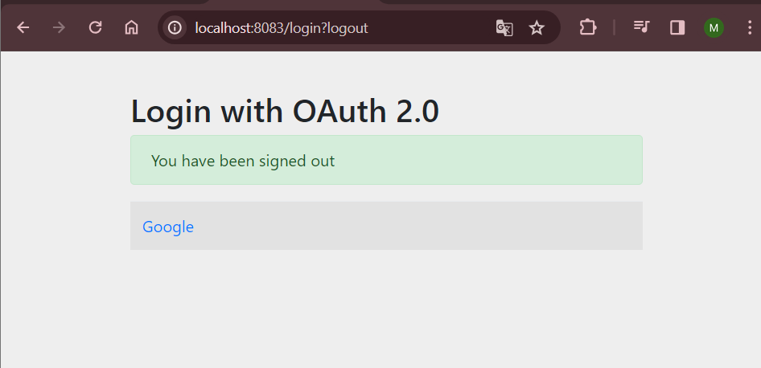

<h1>GASMI MANAL</h1>
<h3>Activité Pratique N°5 :Sécuriser un micro-service avec OAuth2 OIDC avec Keycloak  </h3>
<h2> Liste des clients </h2>

<h2>Interface de console H2</h2>

<h2>Creation de projet console cloud google</h2>

<h2>Ecran de consentement OAuth</h2>

<h2>Interface projet console cloud google</h2>

<h2>Formulaire de consentement</h2>

<h2>Creation de l'identifiant OAuth</h2>

<h2>Information client OAuth </h2>

<h2>Login avec compte google</h2>

<h2>LogOut</h2>

<h2>Partie Github enregistrer une application OAuth</h2>

<h2>Autoriser l'acces avec compte Github</h2>

<h2>Partie Keycloak</h2>
<h2>Création d'un client</h2>

<h2>Création de role </h2>

<h2>Création de User</h2>

<h2>Affecter un mot de passe user1</h2>

<h2>Interface login avec les trois options Google Github et keycloak</h2>

<h2>Interface Register Keycloak </h2>

<h2>Realm settings user registration assign roles</h2>

<h2>Password Policy</h2>

<h2>A partir du Dockerfile on fait le build</h2>

<h2>Génération du jar</h2>

<h2>Docker Compose</h2>

<h2>Interface PGadmin login</h2>

<h2>Interface initiale pgadmin</h2>

<h2></h2>

<h2></h2>

<h2></h2>

<h2></h2>

<h2></h2>

